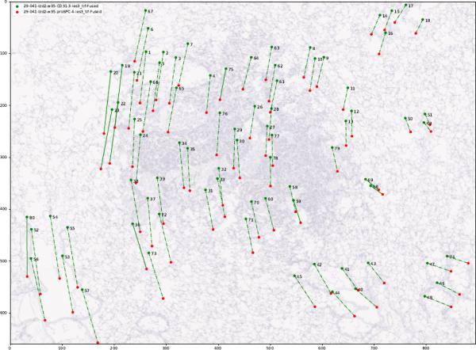
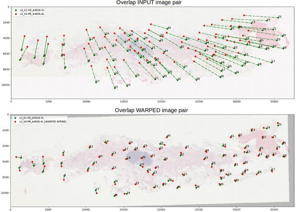

# Dataset: histology landmarks

[](https://travis-ci.org/Borda/dataset-histology-landmarks)
[](https://codecov.io/gh/Borda/dataset-histology-landmarks)
[](https://codebeat.co/projects/github-com-borda-dataset-histology-landmarks-master)
[](https://codeclimate.com/github/Borda/dataset-histology-landmarks/maintainability)
[](https://codeclimate.com/github/Borda/dataset-histology-landmarks/test_coverage)


**Dataset: landmarks for registration of [CIMA histology images](http://cmp.felk.cvut.cz/~borovji3/?page=dataset)**

The dataset consists of 2D histological microscopy tissue slices differently stained. 
The main challenges for the registration of these images are the following: very large image size, appearance differences, and lack of distinctive appearance objects. 
Our dataset contains 108 image pars and manually placed landmarks for registration quality evaluation.


The images composing the CIMA dataset are available [here](http://cmp.felk.cvut.cz/~borovji3/?page=dataset). 
**Note** that the available landmarks are mostly the result from a single user annotation. 
This is a work in progress. It would be interesting to have more precise landmarks computed as the fusion of several users' annotations. Please, consider to contribute to the task!

---

## Landmarks

The landmarks have standard [ImageJ](https://imagej.net/Welcome) structure and coordinate frame. 
The origin [0, 0] is located in top left corner of the image plane. 
For handling these landmarks, we provide a simple macro for [importing](annotations/multiPointSet_import.ijm) and another one for [exporting](annotations/multiPointSet_export.ijm).

The structure of the landmarks file is as follows:
```
 ,X,Y
1,226,173
2,256,171
3,278,182
4,346,207
...
```
 and it can be simply imported by `pandas` as `DataFrame`.

The landmarks files are stored in the same folder as their corresponding images and share the same name. 
```
**DATASET**
 |- [set_name1]
 |  |- scale-[number1]pc
 |  |   |- [image_name1].jpg
 |  |   |- [image_name1].csv
 |  |   |- [image_name2].jpg
 |  |   |- [image_name2].csv
 |  |   |  ...
 |  |   |- [image_name].jpg
 |  |   '- [image_name].csv
 |  |- scale-[number2]pc
 |  |  ...
 |  '- scale-[number]pc
 |      |- [image_name1].png
 |      |- [image_name1].csv
 |      |  ...
 |      |- [image_name].png
 |      '- [image_name].csv
 |- [set_name2]
 | ...
 '- [set_name]
```
See the attached [dataset](dataset) examples.

The landmarks for all the images are generated as consensus over all the available expert annotations: 
```bash
python handlers/run_generate_landmarks.py \
    -a ./annotations -d ./dataset \
    --scales 5 10 25 50
```

A routine to visualize the landmarks overlay on the histological image has been created. 
It is also possible to visualize histological images pairs and the correspondence between the landmarks pairs. 
Namely, the landmarks pairs in both images are connected by a line.  
It is expected that in this case, the landmarks' main direction of displacement can be observed and the affine transformation relating the pair of images, estimated.
```bash
python handlers/run_visualise_landmarks.py \
    -l ./dataset -i ./dataset -o ./output \
    --scales 5 10 --nb_jobs 2
```

There is a verification procedure before any new annotation is added to the "authorised" annotation. 
First, it is checked that you did not swap any landmark or disorder them. 
This can be simply observed from the main displacement direction of all the landmarks in a particular sequence of images pairs. 
Second, the error of the new annotation should not be significantly larger than that of a reference annotation. 

---

## Annotations

### Initial annotation

The annotation is a collection of landmarks placed by several users. 
The structure is similar to the one used in the dataset with the minor difference that there is user/author "name" and the annotation is made just in a single scale.


Tutorial how to put landmarks in a set of images step by step:
 1. Open **Fiji / ImageJ**
 2. Load all images (e.g., drag & drop from open folder) in the set and determine what structures appear in all images. Sample image set is `lung-lesion_1/scale-25pc/*.jpg` or `mammary-gland_2/scale-25pc/*.jpg` 
 3. Start placing landmarks in all images, recommended is to place each landmark in all images fist before the next landmark.
 4. You should place between 60-120 points in each image.
 5. Export annotation and name the CSV file the same as the images.
 6. (Optional) Import the existing landmarks if needed.


### Additional landmark annotation

The goal of this additional annotation is to improve the precision of annotation since it is just human manual annotation which can be inaccurate because of used zoom (scale) and each user may recognise the structure a bit shifted.

**Particular steps:**
 1. Just one image pair or all images in the set (use maximal image scale that you can reasonably open on your computer).
 2. Load landmarks (not annotation from another user) for the first image in the set and use it as a template.
 3. Start placing landmarks in all other images in the same order as the “reference” image, recommended is to place all landmarks in each image before you move to the next image.
 4. You should have the same number points as the initial annotation.
 5. Export your annotation (not the reference landmarks) and name the CSV file the same as the images.

**Example:** Assume we have set of three images with used stains HE, CD and ER. Open images with HE and CD stains. Then you load landmarks for HE image and perform annotation on CD image and export only the CD annotation. Then do this pair-annotation repetitively until you have annotated all stains in the set. See the following sample scenarios:
 * Scenario - pairs
   - open HE -> annotate CD
   - open CD -> annotate ER
   - open ER -> annotate HE
 * Scenario - sequence
   - open ER -> annotate HE and CD
   - open CD -> annotate ER

**Note - point ordering:**
The placed points in the additional annotation have to be in the same order as in ten reference image. Also, while placing the landmarks you have to start with the first point and gradually continue until the last point. (placing less point is also an option even preferably you should reuse all points)

**Note - adding extra points:**
You can add also additional landmarks but still, you have to place all existing landmarks first and then you can start placing extra points. In such a case, you have to add these points for all images in the set (cannot be done just for an image pair).


**Structure of the annotation directory:**
```
**ANNOTATIONS**
 |- [set_name1]
 |  |- user-[initials1]_scale-[number2]pc
 |  |   |- [image_name1].csv
 |  |   |- [image_name2].csv
 |  |   |  ...
 |  |   '- [image_name].csv
 |  |- user-[initials2]_scale-[number1]pc
 |  |  ...
 |  |- user-[initials]_scale-[number]pc
 |  |   |- [image_name2].csv
 |  |   |  ...
 |  |   '- [image_name].csv
 |- [set_name2]
 | ...
 '- [set_name]
```
See the attached dataset [annotation](annotations).

### Placement of relevant points

Because it is not possible to remove already placed landmarks, check if the partial structure you plan to annotate appears in all images before you place the first landmark in any image:
1. Select `Multi-point tool`, note that the points are indexed so you can verify that the actual points are fine.
2. To move in the image use Move tool and also Zoom to see the details.
3. Place landmarks in significant structures of the tissue like edges or alveolar sac centroids appearing in all cuts of the tissue. Each image should contain about 80 landmarks.


### Work with Export / Import macros

**Exporting finally placed landmarks**
When you finish to place landmarks on all the images, export each of them into separate files.
1. Install macro to export landmarks: Select `Plugins -> Marcos -> Install...`
and then, select exporting macro `annotations/multiPointSet_export.ijm`.
2. Select one image and click `Plugins -> Marcos -> exportMultipointSet`.
3. Choose for the landmark file the same name as the one of the image (without any annex).
4. The macro automatically exports all landmarks corresponding to the image in `.csv` format to the chosen directory.

**Importing existing landmarks**
When you need to correct for previously stored landmarks or to continue annotating an image, load the landmarks from a file using the importing existing landmarks macro. Note that the macro uses `.csv` format.
1. Install importing macro `annotations/multiPointSet_import.ijm`.
2. Select one image and click `Plugins -> Marcos -> importMultipointSet`.
3. Then, the correct landmarks set can be selected by its name. 


### Validation

There are to scenarios of validation - if you are the first user doing annotation for the particular tissue there is only visual inspection with highlighting larger deformation from estimated affine transform. 
```bash
python handlers/run_visualise_landmarks.py \
    -l ./annotations -i ./dataset -o ./output \
    --nb_jobs 2
```

In the visualization, the landmarks pairs in both images are connected by a line. 
An affine transformation is computed between the two sets of landmarks. 
Then, the error between the landmarks in the second image and the warped landmarks computed from the second image are computed. 
Finally, if the error is larger than five standard deviations, we consider them as a suspicious pair (either the result of a wrong localization of a large elastic deformation). 
In the visualization, they are connected by a straight line. Otherwise, the landmark pair si connected by a dotted line. 



We recommend looking at the warped image pairs (it is generated automatically if you  have installed OpenCV) where an affine transformation between two images was estimated from landmarks and the second image with landmarks was warped to the first image.



In case you do another annotation for tissue with already existing annotations you should also check your difference to the already existing consensus landmarks makde by other users/experts and are saved in a file.
Then, you need to focus on landmarks where the standard deviation or the maximal error value exceed a reasonable value.
```bash
python handlers/run_evaluate_landmarks.py \
    -a ./annotations -o ./output
```
If you find such suspicious annotations, perform a visual inspection as described above.

---

## References

J. Borovec, A. Munoz-Barrutia, and J. Kybic, “**Benchmarking of image registration methods for differently stained histological slides**” in 2018 25th IEEE International Conference on Image Processing (ICIP), p. 3368-3372, 2018. DOI: [10.1109/ICIP.2018.8451040](https://www.doi.org/10.1109/ICIP.2018.8451040)
