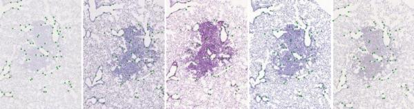
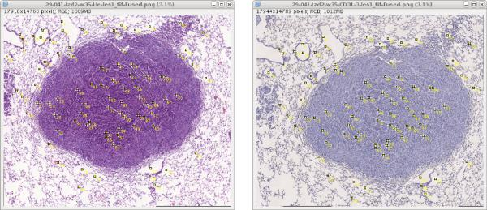
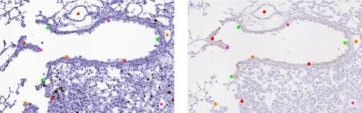

# Dataset: histology landmarks

[](https://travis-ci.org/Borda/dataset-histology-landmarks)
[](https://codecov.io/gh/Borda/dataset-histology-landmarks)
[](https://codeclimate.com/github/Borda/dataset-histology-landmarks/maintainability)
[](https://codeclimate.com/github/Borda/dataset-histology-landmarks/test_coverage)

- TODO - visualise landmarks 
- TODO - user consensus, landmark error

**Dataset: landmarks for registration of [histology images](http://cmp.felk.cvut.cz/~borovji3/?page=dataset)**

The dataset consists of 2D histological microscopy tissue slices, stained with different stains. The main challenges for these images are the following: very large image size, appearance differences, and lack of distinctive appearance objects. Our dataset contains 108 image pars and manually placed landmarks for registration quality evaluation.



The image part of the dataset are available [here](http://cmp.felk.cvut.cz/~borovji3/?page=dataset). **Note** that the accompanied landmarks are the initial from a single a user and the precise landmarks should be obtain by fusion of several users even you can help and improve the annotations.


## Landmarks

The landmarks have standard [ImageJ](https://imagej.net/Welcome) structure and coordinate frame (the origin [0, 0] is located in top left corner of the image plane). For handling this landmarks we provide a simple macros for [import](annotations/multiPointSet_import.ijm) and [export](annotations/multiPointSet_export.ijm).

The folder structure is the same as for images so the landmarks share the same names with the image and they are located in the same directory next to images.

```
DATASET
 |- [set_name1]
 |  |- scale-[number1]pc
 |  |   |- [image_name1].png
 |  |   |- [image_name1].csv
 |  |   |- [image_name2].png
 |  |   |- [image_name2].csv
 |  |   |  ...
 |  |   |- [image_name].png
 |  |   '- [image_name].csv
 |  |- scale-[number2]pc
 |  |  ...
 |  '- scale-[number]pc
 |      |- [image_name1].png
 |      |- [image_name1].csv
 |      |  ...
 |      |- [image_name].png
 |      '- [image_name].csv
 |- [set_name2]
 | ...
 '- [set_name]
```

The landmarks for all images are generated as consensus over all user providing they annotation for a particular image set. 
```bash
python handlers/run_generate_landmarks.py \
    -i annotations -d landmarks  --scales 10 25 50
```
There is a verification procedure before any new annotation is added the "authorised" annotation.
```bash
python scripts/run_.py \
    ...
```

## Annotations

The annotation is a collection of landmarks placement from several users. The structure is similar to the used in dataset with minor difference that there is user/author "name" and the annotation is made jut in single scale.



Tutorial how to put landmarks in set of images step by step:
1. Open **Fiji**
2. Load images (optimal is to open complete set)
3. Click relevant points (landmarks) in all images.
4. Exporting finally placed landmarks.
5. Importing existing landmarks if needed.

Structure of the annotation directory:
```
DATASET
 |- [set_name1]
 |  |- user-[initials1]_scale-[number2]pc
 |  |   |- [image_name1].csv
 |  |   |- [image_name2].csv
 |  |   |  ...
 |  |   '- [image_name].csv
 |  |- user-[initials2]_scale-[number1]pc
 |  |  ...
 |  |- user-[initials]_scale-[number]pc
 |  |   |- [image_name2].csv
 |  |   |  ...
 |  |   '- [image_name].csv
 |- [set_name2]
 | ...
 '- [set_name]
```

### Placement of relevant points

Because it is not possible to remove already placed landmarks, check if the partial stricture you want to annotate appears in all images before you place first landmark in any image:
1. Select `Multi-point tool`, note that the points are indexed so you can clearly verify that the actual points are fine.
2. To move in the image use Move tool and also Zoom to see the details.
3. Put points (landmarks) to the important parts of the tissue like edges of centroid of bubbles appearing in all cuts of the tissue. Each image should contain about 80 landmarks.



### Work with Export / Import macros

**Exporting finally placed landmarks**
When all landmarks are placed on all images, export each of them into separate files.
1. Install macro for export landmarks, such that select `Plugins -> Marcos -> Instal...`
then select exporting macro `annotations/multiPointSet_export.ijm`.
2. Select one image and click `Plugins -> Marcos -> exportMultipointSet`.
3. Chose name the landmark file to be same as the image name without any annex.
4. The macro automatically exports all landmarks from the image in `.csv` format into chosen directory.

**Importing existing landmarks**
For concretion already made landmarks or continuation from last time an importing landmarks would be needed to restore landmarks from file (Note, the macro uses `.csv` format).
1. Install importing macro `annotations/multiPointSet_import.ijm`.
2. Select one image and click
`Plugins -> Marcos -> importMultipointSet`.
3. Then you select demanded landmarks by its name.


### Validation

When the landmark placement phase is done we need to check all landmarks are correct. 
We have an automatic script which take whole image and landmark set and ...

```bash
python ...
```

## References

J. Borovec, A. Munoz-Barrutia, and J. Kybic, “**Benchmarking of image registration methods for differently stained histological slides**” in IEEE International Conference on Image Processing (ICIP), 2018.
